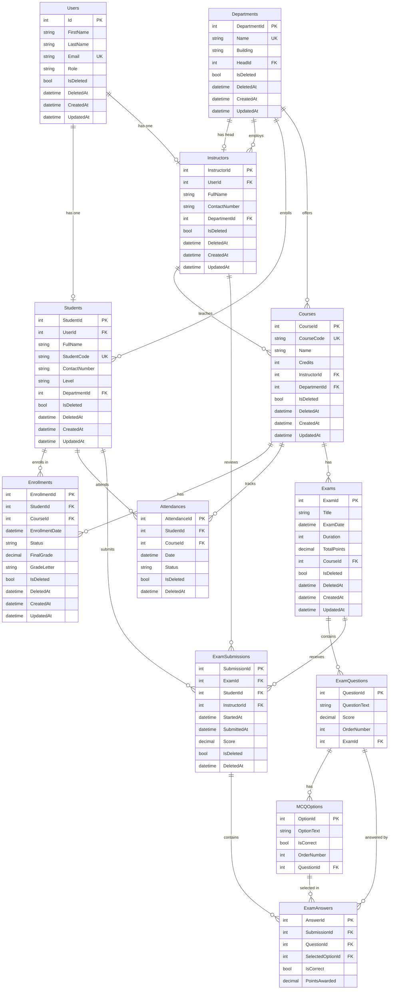

## 1. Overview

This document outlines the database design for the University Management System, a relational database built using SQL Server and managed via Entity Framework Core (EF Core) in a code-first approach with migrations. The design follows Clean Architecture principles, emphasizing data integrity, soft delete functionality, and role-based access control integration.

The database supports core university operations including user management, academic structuring (departments, courses, enrollments), attendance tracking, examination management (exams, questions, submissions, answers), and automated grading.

### 1.1 Key Design Principles
- **Relational Model**: Uses normalized tables to minimize redundancy while maintaining performance.
- **Soft Delete**: All major entities include `IsDeleted`, `DeletedAt` fields to preserve data integrity without permanent deletion.
- **Timestamps**: Entities track `CreatedAt` and `UpdatedAt` for auditing.
- **Unique Constraints**: Enforced on codes (e.g., StudentCode, CourseCode) and emails.
- **Foreign Keys**: Ensure referential integrity across relationships.
- **Indexing**: Implicit indexes on primary keys and foreign keys; additional indexes on frequently queried fields like codes and dates.
- **Database Engine**: SQL Server 2022 or later.

### 1.2 Tools and ORM
- **ORM**: Entity Framework Core for mapping entities to tables, handling relationships, and migrations.
- **Approach**: Code-first with fluent API configurations in the Infrastructure layer.
- **Soft Delete Implementation**: Global query filters in EF Core to exclude soft-deleted records by default.

## 2. Entity-Relationship Diagram

The following ER diagram (in Mermaid format) visualizes the database schema, including entities, attributes, and relationships:
![[EDD.png]]

### 2.1 Relationship Details
- **One-to-One**: Users to Students/Instructors (a user can be either a student or instructor).
- **One-to-Many**: Departments to Instructors/Students/Courses (a department employs instructors, enrolls students, offers courses).
- **Many-to-Many**: Students and Courses via Enrollments.
- **Hierarchical**: Exams contain Questions, which have Options; Submissions contain Answers.
- **Self-Referential**: Departments have a Head (an Instructor).
- **Cascade Deletes**: Disabled to prevent accidental data loss; soft deletes used instead.

## 3. Entity Descriptions

Below is a detailed list of all tables, their fields, data types, constraints, and purposes.

### 3.1 Users
Core user table integrated with ASP.NET Core Identity for authentication.

| Field          | Data Type    | Constraints                  | Description |
|----------------|--------------|------------------------------|-------------|
| Id             | int          | PK, Auto-Increment           | Unique identifier. |
| FirstName      | string       | Not Null                     | User's first name. |
| LastName       | string       | Not Null                     | User's last name. |
| Email          | string       | UK, Not Null                 | Unique email for login. |
| Role           | string       | Not Null (Admin/Instructor/Student) | User role for RBAC. |
| IsDeleted      | bool         | Default: false               | Soft delete flag. |
| DeletedAt      | datetime     | Nullable                     | Timestamp of deletion. |
| CreatedAt      | datetime     | Default: CURRENT_TIMESTAMP   | Creation timestamp. |
| UpdatedAt      | datetime     | Nullable                     | Last update timestamp. |

### 3.2 Students
Extends Users for student-specific data.

| Field          | Data Type    | Constraints                  | Description |
|----------------|--------------|------------------------------|-------------|
| StudentId      | int          | PK, Auto-Increment           | Unique student ID. |
| UserId         | int          | FK (Users), Unique           | Link to Users table. |
| FullName       | string       | Not Null                     | Full name. |
| StudentCode    | string       | UK, Not Null                 | Unique student code. |
| ContactNumber  | string       | Nullable                     | Phone number. |
| Level          | string       | Not Null                     | Academic level (e.g., "1"). |
| DepartmentId   | int          | FK (Departments)             | Assigned department. |
| IsDeleted      | bool         | Default: false               | Soft delete flag. |
| DeletedAt      | datetime     | Nullable                     | Deletion timestamp. |
| CreatedAt      | datetime     | Default: CURRENT_TIMESTAMP   | Creation timestamp. |
| UpdatedAt      | datetime     | Nullable                     | Update timestamp. |

### 3.3 Instructors
Extends Users for instructor-specific data.

| Field          | Data Type    | Constraints                  | Description |
|----------------|--------------|------------------------------|-------------|
| InstructorId   | int          | PK, Auto-Increment           | Unique instructor ID. |
| UserId         | int          | FK (Users), Unique           | Link to Users table. |
| FullName       | string       | Not Null                     | Full name. |
| ContactNumber  | string       | Nullable                     | Phone number. |
| DepartmentId   | int          | FK (Departments)             | Assigned department. |
| IsDeleted      | bool         | Default: false               | Soft delete flag. |
| DeletedAt      | datetime     | Nullable                     | Deletion timestamp. |
| CreatedAt      | datetime     | Default: CURRENT_TIMESTAMP   | Creation timestamp. |
| UpdatedAt      | datetime     | Nullable                     | Update timestamp. |

### 3.4 Departments
Manages academic departments.

| Field          | Data Type    | Constraints                  | Description |
|----------------|--------------|------------------------------|-------------|
| DepartmentId   | int          | PK, Auto-Increment           | Unique department ID. |
| Name           | string       | UK, Not Null                 | Department name. |
| Building       | string       | Nullable                     | Building location. |
| HeadId         | int          | FK (Instructors)             | Department head instructor. |
| IsDeleted      | bool         | Default: false               | Soft delete flag. |
| DeletedAt      | datetime     | Nullable                     | Deletion timestamp. |
| CreatedAt      | datetime     | Default: CURRENT_TIMESTAMP   | Creation timestamp. |
| UpdatedAt      | datetime     | Nullable                     | Update timestamp. |

### 3.5 Courses
Manages courses with business rules (e.g., unique code, credit limits).

| Field          | Data Type    | Constraints                  | Description |
|----------------|--------------|------------------------------|-------------|
| CourseId       | int          | PK, Auto-Increment           | Unique course ID. |
| CourseCode     | string       | UK, Not Null                 | Unique course code. |
| Name           | string       | Not Null                     | Course name. |
| Credits        | int          | Not Null                     | Credit hours. |
| InstructorId   | int          | FK (Instructors)             | Assigned instructor. |
| DepartmentId   | int          | FK (Departments)             | Offering department. |
| IsDeleted      | bool         | Default: false               | Soft delete flag. |
| DeletedAt      | datetime     | Nullable                     | Deletion timestamp. |
| CreatedAt      | datetime     | Default: CURRENT_TIMESTAMP   | Creation timestamp. |
| UpdatedAt      | datetime     | Nullable                     | Update timestamp. |

### 3.6 Enrollments
Tracks student course enrollments and grades.

| Field          | Data Type    | Constraints                  | Description |
|----------------|--------------|------------------------------|-------------|
| EnrollmentId   | int          | PK, Auto-Increment           | Unique enrollment ID. |
| StudentId      | int          | FK (Students)                | Enrolled student. |
| CourseId       | int          | FK (Courses)                 | Enrolled course. |
| EnrollmentDate | datetime     | Not Null                     | Enrollment date. |
| Status         | string       | Not Null (e.g., "Enrolled", "Completed") | Enrollment status. |
| FinalGrade     | decimal      | Nullable                     | Calculated final grade percentage. |
| GradeLetter    | string       | Nullable                     | Letter grade (e.g., "A+"). |
| IsDeleted      | bool         | Default: false               | Soft delete flag. |
| DeletedAt      | datetime     | Nullable                     | Deletion timestamp. |
| CreatedAt      | datetime     | Default: CURRENT_TIMESTAMP   | Creation timestamp. |
| UpdatedAt      | datetime     | Nullable                     | Update timestamp. |

### 3.7 Attendances
Records student attendance with status.

| Field          | Data Type    | Constraints                  | Description |
|----------------|--------------|------------------------------|-------------|
| AttendanceId   | int          | PK, Auto-Increment           | Unique attendance ID. |
| StudentId      | int          | FK (Students)                | Student. |
| CourseId       | int          | FK (Courses)                 | Course. |
| Date           | datetime     | Not Null                     | Attendance date. |
| Status         | string       | Not Null (Present/Absent/Late/Excused) | Attendance status. |
| IsDeleted      | bool         | Default: false               | Soft delete flag. |
| DeletedAt      | datetime     | Nullable                     | Deletion timestamp. |

### 3.8 Exams
Manages exams associated with courses.

| Field          | Data Type    | Constraints                  | Description |
|----------------|--------------|------------------------------|-------------|
| ExamId         | int          | PK, Auto-Increment           | Unique exam ID. |
| Title          | string       | Not Null                     | Exam title. |
| ExamDate       | datetime     | Not Null                     | Exam date/time. |
| Duration       | int          | Not Null                     | Duration in minutes. |
| TotalPoints    | decimal      | Not Null                     | Total possible points. |
| CourseId       | int          | FK (Courses)                 | Associated course. |
| IsDeleted      | bool         | Default: false               | Soft delete flag. |
| DeletedAt      | datetime     | Nullable                     | Deletion timestamp. |
| CreatedAt      | datetime     | Default: CURRENT_TIMESTAMP   | Creation timestamp. |
| UpdatedAt      | datetime     | Nullable                     | Update timestamp. |

### 3.9 ExamQuestions
Questions within an exam (MCQ or True/False via options).

| Field          | Data Type    | Constraints                  | Description |
|----------------|--------------|------------------------------|-------------|
| QuestionId     | int          | PK, Auto-Increment           | Unique question ID. |
| QuestionText   | string       | Not Null                     | Question text. |
| Score          | decimal      | Not Null                     | Points for the question. |
| OrderNumber    | int          | Not Null                     | Display order. |
| ExamId         | int          | FK (Exams)                   | Parent exam. |

### 3.10 MCQOptions
Options for MCQ/True-False questions.

| Field          | Data Type    | Constraints                  | Description |
|----------------|--------------|------------------------------|-------------|
| OptionId       | int          | PK, Auto-Increment           | Unique option ID. |
| OptionText     | string       | Not Null                     | Option text. |
| IsCorrect      | bool         | Default: false               | Correct answer flag. |
| OrderNumber    | int          | Not Null                     | Display order. |
| QuestionId     | int          | FK (ExamQuestions)           | Parent question. |

### 3.11 ExamSubmissions
Student submissions for exams.

| Field          | Data Type    | Constraints                  | Description |
|----------------|--------------|------------------------------|-------------|
| SubmissionId   | int          | PK, Auto-Increment           | Unique submission ID. |
| ExamId         | int          | FK (Exams)                   | Submitted exam. |
| StudentId      | int          | FK (Students)                | Submitting student. |
| InstructorId   | int          | FK (Instructors)             | Reviewing instructor. |
| StartedAt      | datetime     | Not Null                     | Start timestamp. |
| SubmittedAt    | datetime     | Nullable                     | Submission timestamp. |
| Score          | decimal      | Nullable                     | Calculated score. |
| IsDeleted      | bool         | Default: false               | Soft delete flag. |
| DeletedAt      | datetime     | Nullable                     | Deletion timestamp. |

### 3.12 ExamAnswers
Individual answers in a submission.

| Field            | Data Type    | Constraints                  | Description |
|------------------|--------------|------------------------------|-------------|
| AnswerId         | int          | PK, Auto-Increment           | Unique answer ID. |
| SubmissionId     | int          | FK (ExamSubmissions)         | Parent submission. |
| QuestionId       | int          | FK (ExamQuestions)           | Answered question. |
| SelectedOptionId | int          | FK (MCQOptions)              | Selected option. |
| IsCorrect        | bool         | Default: false               | Correctness flag. |
| PointsAwarded    | decimal      | Not Null                     | Points given. |

## 4. Constraints and Business Rules Enforced in DB
- **Unique Indexes**: On Email (Users), StudentCode (Students), CourseCode (Courses), Department Name.
- **Check Constraints**: Credits > 0, Duration > 0, Score >= 0.
- **Triggers/Views**: Potential for triggers on grade calculation (though handled in application layer).
- **Business Rules**: Enforced via application logic (e.g., max credits via queries), but DB ensures data consistency (e.g., no orphan records via FKs).
- **Grade Calculation**: Stored in Enrollments; computed in app based on submissions.

## 5. Indexing Strategy
- **Primary Indexes**: On all PKs.
- **Foreign Key Indexes**: Automatic on FKs.
- **Composite Indexes**: On (StudentId, CourseId) in Enrollments/Attendances for quick lookups.
- **Date Indexes**: On Date fields (e.g., ExamDate, EnrollmentDate) for range queries.
- **Full-Text Search**: Potential on text fields like QuestionText if needed.

## 6. Data Seeding
The database seeds default users (Admin, Instructors, Students) via EF Core migrations. Example:
- Admin: amal@gmail.com / Password@123
- See API Documentation for full seed data.

## 7. Migration and Maintenance
- **Migrations**: Use `dotnet ef migrations add` and `dotnet ef database update`.
- **Backup Strategy**: Regular SQL Server backups; soft deletes reduce need for immediate restores.
- **Performance Considerations**: Query optimization via EF Core includes/explicit loading; monitor with SQL Profiler.
